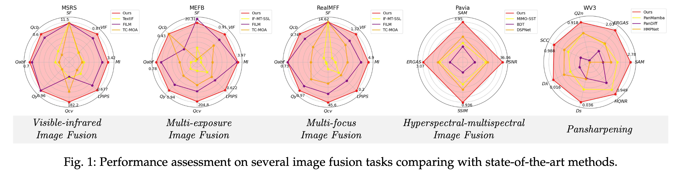
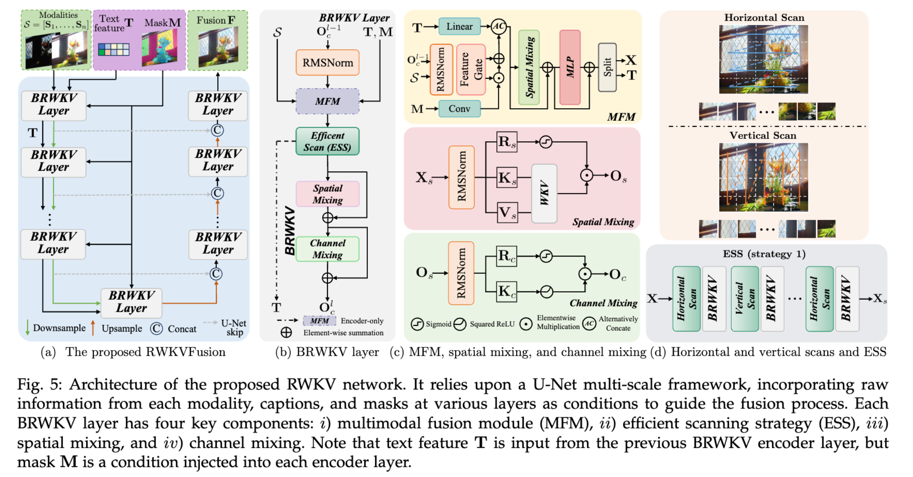

# RWKVFusion [TPAMI 2025]

<div align="center">
  <a href=https://scholar.google.com/citations?user=pv61p_EAAAAJ&hl=en> Zihan Cao </a> |
  <a href=https://scholar.google.com/citations?user=E5KO9XsAAAAJ&hl=en> Yu-Jie Liang </a> |
  <a href=https://scholar.google.com/citations?user=TZs9NxkAAAAJ&hl=en> Liang-Jian Deng |
  <a href=https://scholar.google.com/citations?user=sjb_uAMAAAAJ&hl=en> Gemine Vivone</>

  <a>University of Electronic Science and Technology of China (UESTC) </a><br>
  <a>Institute of Methodologies for Environmental Analysis, CNR-IMAA </a>
</div>


Official implementation of [Unify language and mask guidance in an efficient network (TPAMI)](https://ieeexplore.ieee.org/document/11091495).

This work builds a unified image fusion framework that harnesses the unified language, mask guidance, and an RWKV-based network to fuse images.

<!-- Images -->
<div align="center">

<p><em>Figure 1: Results comparisons.</em></p>
</div>

<div align="center">

<p><em>Figure 2: RWKVFusion network architecture.</em></p>
</div>


# News
**[2025/09/11]**: WIP - We released the training and inference code of RWKVFusion. We are now preparing the pre-trained checkpoints and used dataset. We will soon release the results. Please stay tuned.


# Fast Run

## Data preparation
Please refer the [data preparation](data_preparation/README.md) section.

## Training
You can simply run different tasks (VIF, MEF, MFF, Medical image fusion, Pansharpening, and HISR) with the following command:
```bash
sh scripts/train/train_rwkvfusion_VIF.sh
```
to start training on VIF task.
Please check the [`scripts/train`](scripts/train) directory for more details.


## Inference
After we release the trained models, you can simply run different commands to inference RWKVFusion models:
```bash
sh scripts/test/sharpening.sh
```
to start inference on Pansharpening task, for example. Please check the [`scripts/test`](scripts/test) directory for more details.


## Metrics
We rewrite the VIF, MEF, and MFF metrics in Python, which originally implemented in MATLAB. Please check the [`scripts/py_scripts`](scripts/py_scripts) directory for more details.

For Pansharpening and HISR tasks, we use the [Pan-collection]() provided [Matlab package](matlab_test_pkgs/Pansharpening_Hyper_SR_Matlab_Test_Package) for evaluation.

# Results
You can access the results of all tasks of RWKVFusion at [BaiduYunDisk-WIP]() (Still in progress).

# Citations
If you find this work useful, please kindly cite our paper:
```bibtex
@ARTICLE{RWKVFusion,
  author={Cao, Zi-Han and Liang, Yu-Jie and Deng, Liang-Jian and Vivone, Gemine},
  journal={IEEE Transactions on Pattern Analysis and Machine Intelligence},
  title={An Efficient Image Fusion Network Exploiting Unifying Language and Mask Guidance},
  year={2025},
  volume={},
  number={},
  pages={1-18},
  doi={10.1109/TPAMI.2025.3591930}
}
```
